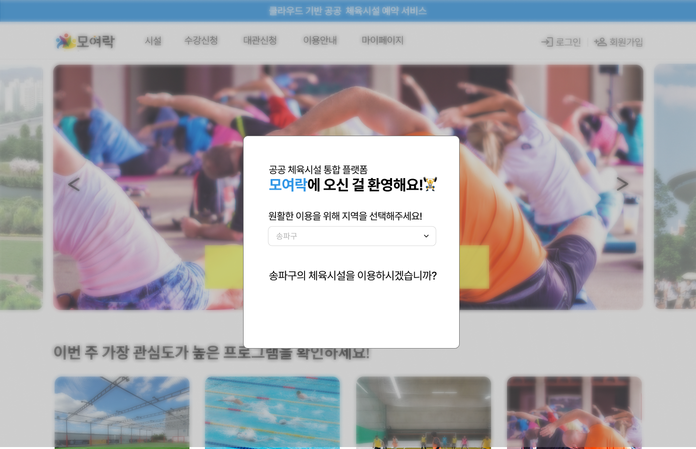
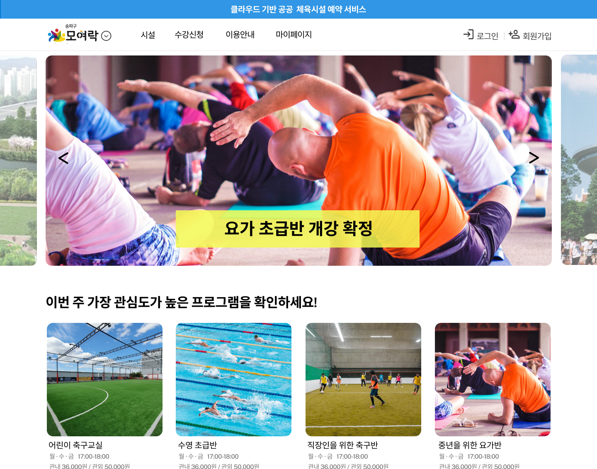
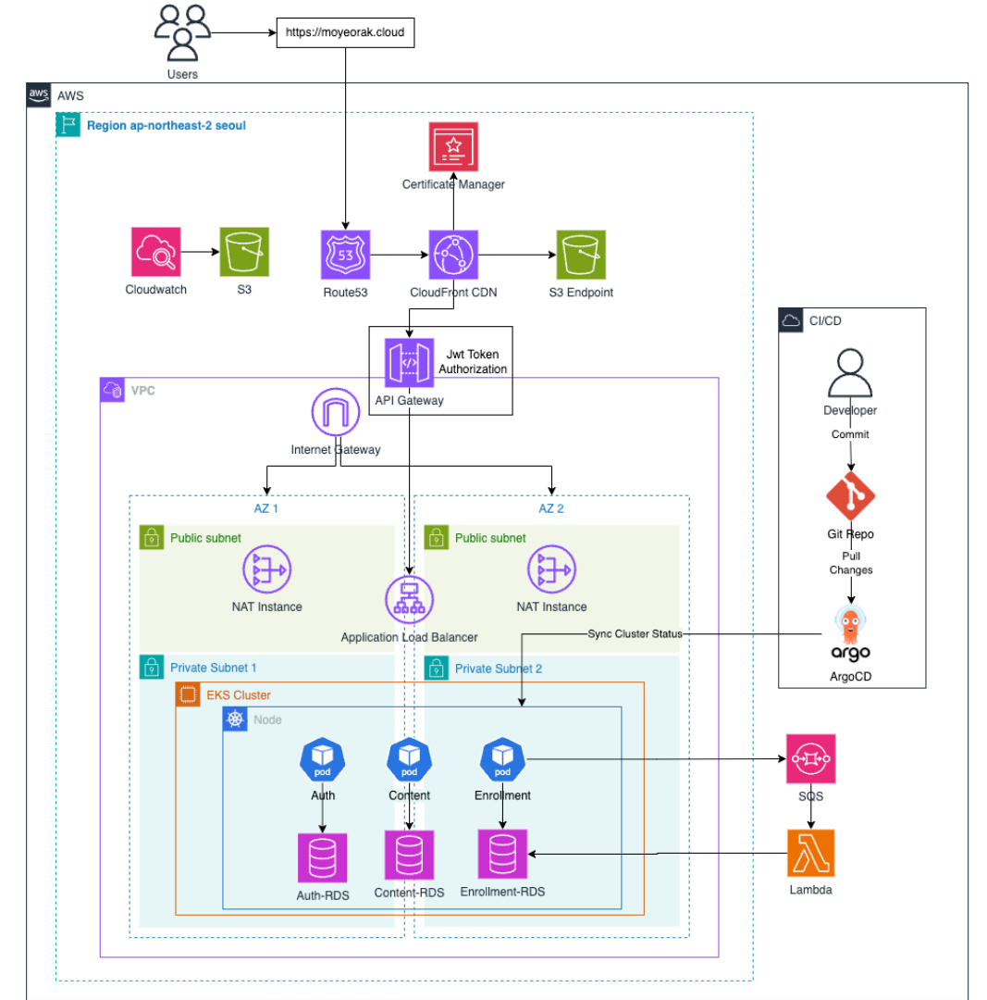

# moyeorak  

## ✅ 기획 배경  
매달 돌아오는 구립 수영장 프로그램 신청일.  
운동하고 싶은 마음은 넘치지만, 접속한 신청 화면은 멈춰버리곤 했다.  
매번 반복되는 불편, 관리자는 없는 걸까 하는 의문까지 들었다.  

게다가 옆 동네 체육시설을 이용하려면 또다시 회원가입을 해야 했다.  
같은 도시, 같은 시민인데, 왜 매번 새로운 가입 절차를 거쳐야 할까?  

이러한 불편을 해결하기 위해, 사용할 때마다 힘든 이용자와  
매번 민원에 지쳐가는 관리자를 위한 서비스 **모여락**이 나오게 되었다!

---

## 🚀 서비스 소개  
> 클라우드 기반 공공 체육시설 플랫폼, **모여락**  

🔑 **통합 회원 시스템** : 한 번의 회원가입으로 여러 지역 체육시설을 이용할 수 있으며 주소지를 기반으로 관내/관외 회원 구분이 자동 적용  
🏊 **편리한 프로그램 신청** : 지역별 프로그램을 조회하고 신청할 수 있으며 트래픽이 몰려도 안정적으로 동작  
☁️ **클라우드 인프라 최적화** : 오토스케일링을 통해 신청일 트래픽 폭주에도 무중단 서비스 제공  
📊 **운영 자동화** : 관리자에게 신청 현황과 서버 상태를 리포트·알림으로 제공, 운영 효율성 ↑  

---

## 🛠 기술 스택  
- **Backend**: Spring Boot (MSA), JPA, MySQL  
- **Infra**: Docker, Kubernetes, AWS  
- **DevOps**: GitHub Actions 
- **Common**: JitPack (moyeorak-common 배포)  

---

## 📂 프로젝트 구조  
- **auth-service** : 로그인, 회원가입, JWT 발급, 회원 정보 관리 (관리자/유저 권한 분리)  
- **enrollment-service** : 수강 신청 관리  
- **content-service** : 지역, 시설, 프로그램, 메인 이미지 관리  
- **moyeorak-common** : 공통 에러 핸들링 및 DTO 모듈 (JitPack 배포)  

---

## 🏗 시스템 아키텍처 

## 📂 서비스별 레포지토리
- [auth-service](https://github.com/leeenzang/auth-service.git)  
- [content-service](https://github.com/leeenzang/content-service)  
- [enrollment-service](https://github.com/leeenzang/enrollment-service)  
- [moyeorak-common](https://github.com/leeenzang/moyeorak-common)  